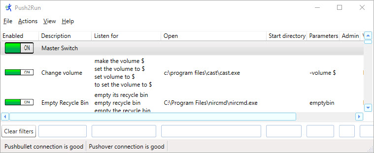

# Push2Run
Push2Run is a free open source home automation program that lets you control your Windows computer using an:

 - Apple iPhone/iPad running Siri,
 - Amazon Alexa device or smartphone running Alexa,
 - Google Assistant device (Nest Hub, Home, Mini, Max, etc.) or smartphone running Google Assistant,
 - automation service (such as Home Assistant, Node-Red, or Tasker), and/or
 - Windows batch/script/command line processing.

In various combinations [PushBullet](https://www.pushbullet.com/), [Pushover](https://pushover.net/), [Dropbox](https://dropbox.com/), [IFTTT](https://ifttt.com/), [MQTT](https://en.wikipedia.org/wiki/MQTT), [PC Commander](https://pccommander.net/), and/or [Everything](https://www.voidtools.com/) may also be needed to glue things together as explained in the setup and help documentation linked below.

 	
For issuing verbal commands, maximum versatility is available when using an Amazon Alexa device with the PC Commander skill and Pushbullet, or an Apple iPhone/iPad with Siri (please see the setup link below for more information).  With these setups you can use variable expressions.  For example you can tell your computer to:

- show you pictures of kittens (or anything else)
- set its volume to x percent (where x is any number between 0 and 100)
- play a song (where the song is any song stored on your computer and identified by it's name)

Beyond that. the program offers a great deal of functionality when driven using the other platforms listed above as well.  With all setups you can tell your computer to do specific pre-determined actions like:

 - do a quick backup
 - mute its volume
 - open Device Manager
 - start a specific program
 - shutdown

Also, in all cases, Push2Run can even do a bit of typing for you, sending keystrokes to your desktop or the applications that it starts on your behalf.
 	
You're welcome to use Push2Run for free on as many computers as you like!   
 	 	 
Push2Run is funded by kind donations from people such as yourself.

 ## Setup 

 ## Help

 ## Download

 ## Support Push2Run

 

