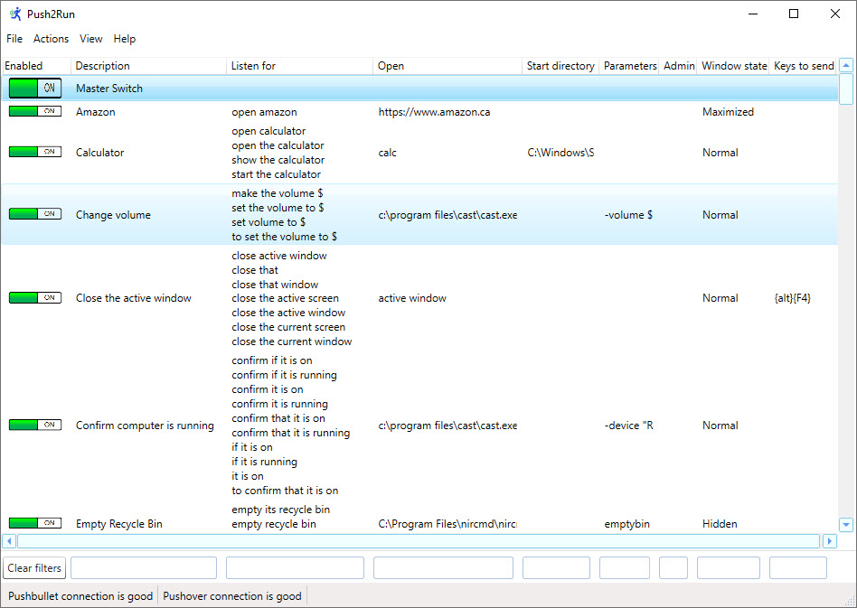
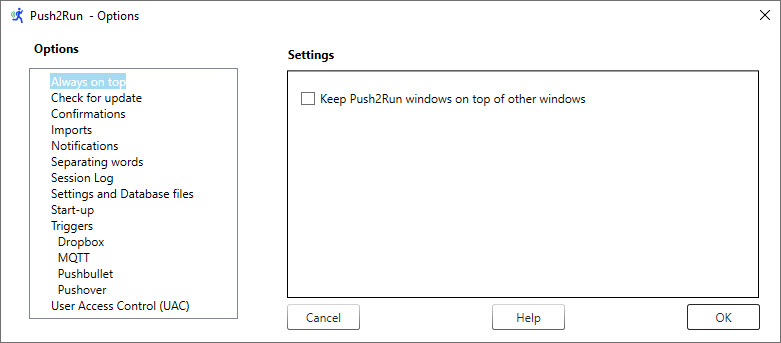
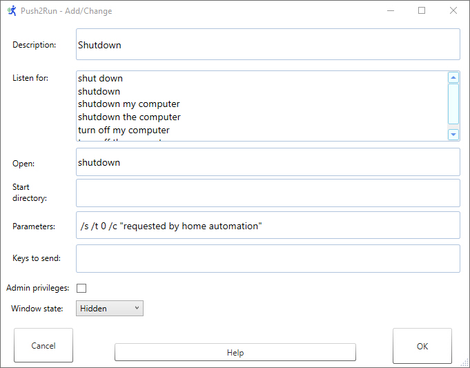
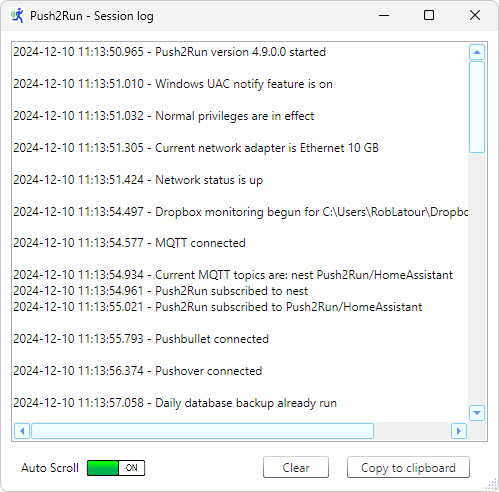
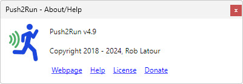

# Push2Run Help v4.9

Welcome to the Push2Run version 4.9 Help page. 
## This page covers the following: 
[An overview of Push2Run](#overview) 
[The Push2Run icon on your screen and in your systray](#icon) 
[The Main window](#main) 
[The Options window](#options) 
[The Add/Change window](#change) 
[The Session log window](#sessionlog) 
[The About/Help window](#help) 
[Performing actions when there are no matching or enabled phrases](#nomatch) 
[Dragging and Dropping vs Importing and Exporting](#dragging) 
[Using Push2Run from the command line](#command) 
## Other topics
For first time setup, please see [the Push2Run Setup page](setup.md) 
For an example of how to send a custom text, as words to be spoken, to your Google device please see this [how to page](usingcast.md)
 For the version history, please see [the Push2Run Version History page](versionhistory.md). 

## An overview of Push2Run
Push2Run is free program which allows you to control your Windows computer based on voice commands given to your Apple iPhone/iPad, Amazon Alexa, Google Assistant (Google Home, Google Mini, Google Max, or smart phone running Google Assistant) with the help of [IFTTT](https://ifttt.com/) and [Pushbullet](https://www.pushbullet.com/), [Pushover](https://pushover.net/), [Dropbox](https://www.dropbox.com/) and or [MQTT](https://en.wikipedia.org/wiki/MQTT).  You can also give it commands via the Windows command line, batch or script files.  
  
With Push2Run you will be able to say things like "Siri tell my computer to" / "Alexa trigger" / "OK Google action"... "check the CBC news website", "open my budget", "run a quick backup" or "shutdown my computer".  
  
With an Amazon Alexa or Google Assistant set ups you can have Push2Run run specific predetermined actions like those just mentioned.  
  
With an Apple iPhone/iPad setup you can also do all of that, plus use variable phrases to say things like "Siri tell my computer to" ... (pause) ... "play 99 Red Balloons" (or any other song without specifically setting up for that specific song in advance).  
  
With MQTT, you can have Push2Run subscribe to topics on your MQTT server and react to them as they are published.  
  
As you can give these commands via your iPhone/iPad, Amazon Alexa, or Google Assistant you don’t even need to be at your computer to do so. Handy for giving certain commands from another room or place.  

## The Push2Run icon on your screen and in your systray
 To start Push2Run you can click on the Push2Run icon on your desktop (if you have it there) or in the list of your Windows programs accessible from the Windows' start icon.   
  
The program may also be started automatically when you sign onto Windows based on your choice in the program's Options window.
  
When running, the Push2run icon will appear in your systray (usually found in the bottom right hand side of your screen, near your system clock). Double clicking on the Push2Run icon on your screen or in your systray will cause the Push2Run Main window to open.  Left clicking on the Push2run systray icon the program will provide you quick menu of Push2Run windows to open.  Another option you will see when you left click on the Push2run systray icon is the option to Pause.  You can toggle the Pause option on or off - it is the same as turning the master switch off or on.  
  
When Push2Run is running normally the background of the Push2Run systray icon will be white. However, if the master switch is turned off, the systray Pause option is checked, or if the program is not connected to Pushbullet then the background of the Push2run systray icon will be red.

## The Main window

The Main window allows you to add, change and remove what Push2Run listens for and how it reacts to what it hears. The Main window also allows you to tailor what information is shown and how.  As well, it provides access to the session log and help / about windows.  
  
### What Push2Run listens for and how it reacts to what it hears 
  
Push2Run listens for specific phrases, and when it hears them runs the commands / programs you tell it to.  
  
From the Main window you can toggle on and off the monitoring all at once or individually by command.  
  
A Master Control Switch allows you to toggle on and off all monitoring, simply clicking the on/off switch to make this happen.  
  
When you toggle the Master Control Switch 'off' all monitoring is paused. When you toggle the Master Switch 'on' all the commands which were being individual monitored the last time the switch was turned on will be turned on once again.  
  
Monitoring of individual command can be turned on and off by clicking their associated switches.  
  
Individual commands can be added, changed, and removed via the Actions item on the Main windows' menu bar, this is described in more detail below. 

The Main window does not need to be open for Push2Run to process incoming triggers, in fact if the Main window is closed / minimized then processing will happen quicker as the status bar at the bottom of the Main window does not need to be updated to show progress.
  
### What is shown on the Main window
  
The Main window also allows you to arrange/organize the order of what it is monitored, as well as the information displayed on each line.  
  
Along the top of the Main window there is a menu bar. In the menu bar there are three main menu items: Actions, View, and Help.  
  

|     |     |     |     |
| --- | --- | --- | --- |
| **Under the 'File' menu item you can:** |     |     |     |
| **Set Options** |     | Click 'Options' to open the Options window. |     |
| **Import cards into Push2Run** |     | Click 'Import' to import cards into the Push2Run database.      Duplicate cards - Push2Run cards being imported and which are already in the database will be ignored, even if the description of the card is different.      If the Action 'Sort by description' is checked the imported cards will appear on the Main window sorted in alphabetically based on their description along with the cards already in the database.   If the Action 'Sort by description' is not checked, the imported cards will be shown at the bottom of the main  window.      You can also import cards by dragging and dropping a Push2Run export file into the Main window.      Imported cards will be added with their On/Off switch set as per your preference in the Options - Imports window.      Imported cards can have their descriptions appended with '(Imported)' as per your preference in the Options - Imports window. |     | | 
**Export all your cards from Push2Run** |     | Click 'Export' to export all your Push2Run cards into a separate export file.      If the options require a password to be entered at start-up, you will be prompted to enter that password again before the export proceeds.  If you do not enter the right password (click 'Cancel' on the password entry screen) then the export will not proceed and Push2Run will exit.      Of note: while the contents of your Push2Run database are encrypted, the content of the file into which the Push2Run cards are exported will NOT be encrypted.  This is important to know especially if you have any information contained in you Push2Run cards, such as a password used in the 'Keys to Send' field, which you would like to safeguard. |     |
| **Exit the program** |     | Click 'Exit' to stop Push2Run from running.      Of note, clicking on the red 'X' in the top right of the Main window will not cause the program to exit, rather it will simply be minimized to the systray (usually found at the bottom right of the primary screen - near the system clock).  The first time you do this, a pop-up window will appear to inform you of this.  There will be an option on that window that you can select to not be reminded of this again. |     |
| **Under the 'Actions' menu item you can:** |     |     |     |
| **Arrange the   order of the rows you see in the   Main windows** |     | Chose to have Main window command line rows either automatically or manually arranged.  To make this choice either check or uncheck the option 'Sort by description'.  When this option is checked the command lines will be automatically sorted on an ongoing basis, when it is unchecked you will be able to arrange the command lines your self by moving them up and down, inserting blank lines, etc.. |     |
| **Undo the effects of the last card update** |     | Click 'Undo' to undo the effects of your last update. |     |
| **Run the currently selected card** |     | Click 'Run' to run the currently selected card.      If the currently selected card requires a variable phrase, you will be prompted to enter it. |     |
| **Change   administrative   privileges   ** |     | Change is Push to run is running with administrative privileges or not. Click on 'Actions - Give Push2Run administrator privileges' / 'Remove administrator privileges form Push2Run' to toggle between running Push2Run with or without administrator privileges.   If Push2Run is running with administrator privileges then it will be able to run other programs with administrator privileges without the Window's UAC notification prompt.      Note: If you are using a version of Windows that predates Windows 10, and you have the Windows UAC feature turned off you will not see the option to change administrative privileges. |     |
| **Under the 'View' menu item you can:** 
| **Chose which   columns you   would like   to see   ** |     | Click on any column name to toggle if you would like that column to be shown or not; you can hide any of the columns except for the switch. |     |
| **Chose to see Cards that have been turned off** |     | With the 'View' - 'Cards that are off' option selected all Push2Run cards (those that are toggled on or off) will be shown.  However, with this feature deselected only cards that are toggled on will be shown. |     |
| **Chose to see a filter line near the bottom of the window** |     | With the 'View' - 'Filters' option selected a line of filter boxes will appear near the bottom of the screen.  These will be aligned with the various columns of the Main window, for example: Description, Listen To, Open, etc..      What is typed in a filter box is used to narrow down the rows displayed in the Main window.  For example if you want to see only entries with the word 'calculator' in the description, just type 'calculator' (without the quotes) in the filter box below the 'Description' column.       The 'Clear filters' button clears all filters.      Note: when the filter is on various menu options - such as add, delete, and undo will be disabled.  These will however be re-enabled when the filters are cleared. |     |
| **Chose to   see the   Session Log** |     | Click on 'Session log' to toggle viewing of the Session log. |     |
| **Under the 'Help' menu item you can:** |     |     |     |
| **Chose to   see the   About/Help window** |     | Click on 'About/Help' to toggle viewing of the About/Help window. |     |
|     |     |     |     |

 **Dragging and Dropping:** 
 

You can drag and drop both to and from the Main window.  
  
**What you can drag out of the Main window:**  
  
You can drag any of the Push2Run cards in the Main window onto your Windows desktop. This will create a Push2Run card file on your Windows desktop with a file extension of '.p2r'. If later you either double clicked on that file or drag it back into to Push2Run Main window, then Push2Run will open it up in the [Add/Change window](#change) as a new card. You can click 'OK' to save it or 'Cancel' to discard it. If you save it, you will need to switch it on in the Main window for it to be active. Push2Run .pr2 files are generally quite small, not encrypted, and can be shared.  
  
**What you can drag into the Main window:**  
  
As noted above you can drag Push2Run card files into the Main window.  
  
You can also drag program icons and shortcuts (including shortcuts to websites) into the Main window. When you drag a program icon or shortcut into the Main window Push2Run will automatically open and fill out the Add/Change window with as much information as it can gather from the program icon or short cut.  You can then update the Add/Change window information as needed and click 'OK' to save it (or 'Cancel' to cancel the update).  The original program icon or shortcut which you dragged into the Main window will remain unchanged.  
  
**IMPORTANT NOTE:**  
You cannot drag and drop into the Main window if Push2Run is running with administrative privileges.  To drag and drop first switch Push2Run to run without administrative privileges.  Later after you have finished dragging and dropping you can switch it back if you like.  
  
**Other ways to open a Push2Run file:**  
A Push2Run file created by dragging it from the Main window can also be opened by double clicking on it or by entering its full name (including its extension) at a Windows command prompt.  
  
 
## The Options window

In the Options window there are two panels. You can select the option you want to work with in the first (left) panel, and then adjust their settings in the right panel (for all but the Settings and Database files option).  
  
For first time setup, please see [the Push2Run Setup page](setup.md)  
  
Most of the options are self explanatory. However, some call for a bit of an explanation / context:  

#### MQTT  

You may subscribe to as many MQTT topics as you like; just add these into the MQTT Topic Filter field in the MQTT Options window, with a space between each topic.  For example:  
  
    weather/temperature weather/pressure weather/humidity  
  
To subscribe to all topics just use the pound sign ("#") alone in the Topic Filter field.
  
As Push2Run will process all incoming topics that you subscribe to, for performance reasons it is better to only subscribe to the topics you want Push2Run to action.   Having that said, when you are first getting started, you might want to subscribe to all topics using the pound sign, and look in the Push2Run session log to see exactly how, and how often, they are coming in.  To view the Push2Run Session log, click on 'View - Session log' from the main window.  
  
Once a MQTT topic is subscribed to, and when a MQTT publication with a matching topic is received by Push2Run, Push2Run will check if any of your Push2Run cards have a 'Listen for' field matching the MQTT publication's payload, and if so Push2Run will run those matching Push2Run cards.  
  
For now, Push2Run's MQTT feature only works with normal MQTT messaging. That is to say MQTT with SSL, MQTT over WebSockets, and MQTT over WebSockets with SSL are currently unsupported.  
  
  
**Using Pushbullet, Pushover, and Dropbox**  
  
You can use one or more of the following services in conjunction with IFTTT to trigger Push2Run processing: Pushbullet, Pushover, and Dropbox. To use a service, click on the appropriate option on the left panel of the option window, and then on the right panel check the option to enable it. 

**Pushbullet - Access Token** - you get this from Pushbullet website - Settings - Access Tokens
  
**Pushbullet - Title Filter -** this is the phrase you use when setting up IFTTT, it separates pushes to be handled by Push2Run from all other pushes. 
  
For example, if you use "Push2Run ROBSOFFICE" as your filter, only pushes containing "Push2Run ROBSOFFICE" will be processed on your computer. You can then set up another computer with a filter of "Push2Run BASEMENT" which only responds to pushes with "Push2Run Basement" in thier title.   Additionally, you can seperate multiple title filters values by a comma.  So for example if you set up your filter as "Push2Run ROBSOFFICE, Push2Run BASEMENT" then Push2Run will react to any pushes with either "Push2Run ROBSOFFICE" or "Push2Run BASEMENT" in them. Finally, of note, this field is not case sensitive; so "Push2Run ROBSOFFICE" works the same as "Push2Run RobsOffice".  
  
**Pushover - Userid** - this is the email id associated with your Pushover account.  
  
**Running the same command on more than one computer at the same time**  
  
Depending on the service you are using in conjunction with Push2Run and IFTTT, you may be able to run the same command on multiple computers at one time.   For this Push2Run needs to be running on all those computers.  
  
For use with the Dropbox and Pushbullet services, the device name of the computer is set up in the Options window.   
  
For use with Dropbox, the Device name on the computer(s) you want to run the program should be identified in the Content field on the first line of your IFTTT applet.  The device name  set on the options window should be used for example to run the command only on the computer with the device name Push2Run\_ROBSPC, the first line of the IFTTT content field should be "Push2Run\_ROBSPC " (without the quotes).  To run the command on the computers with the device names Push2Run\_ROBSPC and Push2Run\_BasementPC the first line of the content field should be "Push2Run\_ROBSPC Push2Run\_BASEMENTPC " (without the quotes).  Note the space between the first and second device name.  You can include as many device names as you like, just separate them by spaces.  
  
For use with Push2Run, the Device name on the computer(s) you want to run the program should be identified in the Title field on your IFTTT applet.  The device name  set on the options window should be used for example to run the command only on the computer with the device name Push2Run ROBSPC, the IFTTT Title filed should be "Push2Run ROBSPC" (without the quotes).  To run the command on the computers with the device names Push2Run ROBSPC and Push2Run BasementPC the IFTTT Title field should be "Push2Run ROBSPC BASEMENTPC" (without the quotes).  Note the space between the first and second device name.  You can include as many device names as you like, just separate them by spaces.  
  
For use with Pushover, the IFTTT Pushover applet identifies which device(s) the command should run on.  The applet allows you to pick one device, or all devices, but not a combination of more than one but less than all.  
  
So to recap, an example of where you might want to do this, is you saying "OK Google action shutdown all  my computers".  
  
To do this you would set up a separate IFTTT command, generally as described in the [setup instructions](setup.html), with the following updates:  
  

|     |     |     |
| --- | --- | --- |
|     | 1.  | the IFTTT entry for what you want to say should be something like 'shutdown all my computers' |
|     |     |     |
|     | 2.  | the IFTTT Dropbox Content field would contain on its first line something like "Push2Run\_ROBSPC  Push2Run\_KAYSLAPTOP Push2Run\_BASMENTPC " (without the quotes),      or      the IFTTT Pushbullet Push a note Title would be something like "Push2Run ROBSPC  KAYSLAPTOP BASMENTPC" (without the quotes),      or      the IFFTT Pushover applet would select all devices |

  
**Separating words** - this option lets you identify the words Push2Run will use separate the things that you say into commands to be run separately by the program.  
  
For example, instead of saying:  
  
  "Siri, tell my computer to" ... pause ... "open the calculator", and  
  "Siri, tell my computer to" ... pause ... "open word".   
  
you might want to just say:  
  
   "Siri, tell my computer to" ... pause .. "open the calculator and open word".   
  
Separating words allow you to do this.  
  
In the above example, the word "and" is a separating word, and it helps change the one thing you say into two commands:  
    1. open the calculator, and  
    2. open word  
The default separating words are "and" and "then".  However, you may remove these, and/or add others if you like.  For example, you might want to add "plus", or if you use Push2Run in French you may want to remove "and" and "then", and add "et" and "puis".   
  
Separating words in the list are separated by a comma.  
  
Separating words are ignored by commands using the $ in the listen for phrase.  
  
For a deeper explanation of this, you are welcome to review the following YouTube video: [https://youtu.be/mDwJ2fT8rBE](https://youtu.be/mDwJ2fT8rBE)
 

**Start-up - Password required** - if this option is checked Push2Run will require a password to be entered each time it starts and when doing exports.  If the correct password is not entered, Push2Run will exit.  
  
The password is case sensitive.    
  
If you set a password and later no longer know it, neither you nor Push2Run will be unable to use your Push2Run related data - and effectively you will need to start over in terms of configuring the program and repopulating all your cards.    
  
By default the password feature is turned off.  If you turn it on, you can turn the it off again - but to do that you will need to know the password which you had last set.
   

**Settings and Database files** - the location of the Settings and Database files are shown but can't be changed.   Clicking on the associated buttons that appear, opens the folders in which the files are kept.   It is a good idea to periodically backup these files to a different location - such as offsite.  Push2Run will periodically back them up for you, but only to the same folder as they currently reside in.   A 'Readme.txt' file can also be found in the same folders that the Settings and Database files reside.  This Readme.txt file explains how to do a restore.
   

**Confirm when importing is done** - is an option that shows up in two places: once under 'Confirmations' and once under 'Imports'. While the option shows up in two places, it is really only one option and changing it in one place automatically changes it in the other.  This is by design to make it easy for you to find and work with the option.
 
  
**[User Access Controls (UAC)](https://docs.microsoft.com/en-us/windows/access-protection/user-account-control/user-account-control-overview)**  - some programs require administrative privileges to run correctly.  With Windows if you have UAC notification turned on then either:  

|     |     |     |
| --- | --- | --- |
|     |     | Push2Run will need to itself be running with Administrative privileges for it to run programs without Windows UAC prompts, |
|     |     | or  |
|     |     | your will need to click on the 'Yes' button when prompted by the Windows UAC notification window to allow a program to run when Push2Run requests it to be run.  In this case, if you click 'No' to the UAC notification prompt, or if don't click the 'Yes' within two minutes of the UAC notification prompt being presented, Windows will automatically terminate the run request - effectively before what ever you had wanted to have run starts running. |

  
 

 
## The Add/Change window

The Add/Change window is where Push2Run is setup to listen for commands and to react to them.  The following describes the Add/Change window:  

**Description** The description is shown as the first column to the right of the switch on the Main window, it is used to help identify what a particular entry is all about  
   
**Listen for** This is where the phrases Push2Run will listen for, and react to, are setup.   
  
The program automatically sorts these for you, removes duplicate entries, and unnecessary white spaces.  All words are also automatically converted to lower case and spell checked with words underlined in red when they are unknown to the spell checker.  
  
With the 'Listen for' phases, you can have Push2Run listen for exact phrases.  
  
For example, exact phrases such as:  
      open the calculator  
      start the calculator  
  
Additionally, asterisks ('\*') may be used as a wild card to have Push2Run listen for expressions containing a broader range of phrases. Here are some examples:   
  
 1.      \* calculator  
           to trigger on any phrase ending with the word 'calculator', such as: 'open the calculator' or 'run the calculator'  
  
 2.      calculator \*  
          to trigger on any phrase starting with the word 'calculator', such as: 'calculator open'  
  
 3.      \* calculator \*  
          to trigger on any phrase containing the word 'calculator', such as: 'open the calculator now'  
  
  
Additionally, in more advanced use, a dollar sign ('$') may be added at the end of the phrase to listen for and Push2Run will pass the end part of your command to the open and parameters fields below.    
  
For example, if you can use:  
          search for $  
  
and in this example, say 'Siri, tell my computer to" ... pause ..  "search for bunny rabbits" and have "bunny rabbits" passed into the Open and Parameters fields for processing (see below for more information).  
  
In more advanced use, you may also use [Regular Expressions](https://en.wikipedia.org/wiki/Regular_expression) (Regex) for matching.  Addtionally, Regex group names used in the 'Listen for' field can be referenced in the 'Open', 'Parameters', and 'Keys to send' fields (described below).  
  
Finally, you can also join two or more commands together by using separating words such as "and" or the word "then".  For example you can say:  
  
   open the calculator and open word  
   or  
   open the calculator then open word  
  
and both actions will be performed assuming you have defined a Push2Run card for each.   
  
You can change the separating words the Push2Run uses in the Options - Separating Words window.  
  
**Open** Open is the program, batch file, script file, file, or website that Push2Run will open when it hears the 'Listen for' phrase.  
  
There are also three special values that can be entered in to the Open field, these are 'Desktop', 'Active Window', and 'MQTT' and will be described later on.  
  
If the program, batch file, or script file is in a directory in your [Windows system path](https://superuser.com/questions/284342/what-are-path-and-other-environment-variables-and-how-can-i-set-or-use-them) then you do not need to enter the full path and filename.  In the above example the program "shutdown.exe" is, by default, found in most systems in the directory C:\\Windows\\System32 folder which is on most systems a directory in the system path.  Accordingly, just entering the name of the program will suffice.   If the program is not in a directory within your system path, then you should enter its full path and filename - for example: C:\\Program Files\\A Ruler for Windows\\aruler.exe  
  
If the file ends with an [extension which your system knows](https://www.lifewire.com/how-to-change-file-associations-in-windows-2624477), then you can just enter the file name in the open field to have Push2Run open it.  For example, if you have MS Office installed, you could just enter   C:\\Users\\your user id\\Documents\\Budgets\\My Budget.xlsx   to have Push2Run open it.  
  
As your system also knows how to deal with websites, you can also enter the name of a website, such as [www.Push2Run.com](http://www.Push2Run.com)  
  
If the 'Listen For' phrase ends with a dollar sign ('$') you can also include the '$' sign to represent the end part of the phrase that Push2Run heard (as described above).  For example in the 'Open' field you can enter https://google.com/search?q=$    
  
Another example is https://www.google.com/search?tbm=isch&q=$ if your 'Listen to' phrase was "to search for pictures of $"  and/or  "to search for images of $".
  
The '$' can be placed anywhere in the url, including at the very end.  
  
As the $ will be replaced by the words you speak each word will separated by a space.  For example "dog cat mouse".  If you would like the spaces between words to be replace by something else then you can identify that something else by surrounding it with square brackets following directly after the $.  For example if you want the spaces between words replaced by commas between words, you would use $\[,\] . If you would like the spaces between words removed entirely you would use $\[\]  
  
Regex group names used in the 'Listen for' field (described above) can be referenced in the 'Open' field.  
  
**Using 'Desktop', 'Active Window', or 'MQTT':**  
  
If the Open field contains just 'Desktop' (without the quotes) the desktop will be focused on - this is used when you want to send keystrokes to your desktop (please see 'Keys to send' below for more information).  
  
If the Open field contains just 'Active Window' (without the quotes) the active window will be focused on - this is used when you want to send keystrokes to your desktop.  
  
If the Open field contains just 'MQTT' (without the quotes) and MQTT is enabled in the Push2Run - Options, Push2Run will publish a topic and payload to the MQTT server that it is connected to.  The Topic and Payload are entered in the Parameter field (see below).  They should be in the format of:  Topic(/Subtopic(s)) (space) Payload.  For example:  
  
  personal/status gone fishing  
  
where the Topic and Subtopic are 'personal/status' and the Payload is 'gone fishing'.  
  
**Using Everything**  
 
Please see this [link](everything.html) which describes how to use the Push2Run Open field in conjunction with the Everything search program.  

**Additional Notes:**
  
In keeping with MQTT standards, the Topic and Subtopics may only contain letters and numbers.  The forward slash ('/') is used to separate Topics from Subtopics, and Subtopics from further Subtopics.  Also the Topic and any and all Subtopics are case sensitive, so 'Personal/status" is not the same as "personal/status".  
  
On a Push2Run card, as a safeguard, the values in the 'Listen for' and 'Open' fields cannot be the same; this to minimize the risk of Push2Run publishing something and then reacting to it in a loop.    
   
**Start directory** Some programs need to be run out of the directory they are found in, others do not.  If the program you want to run requires starting from a particular directory, this is where you can enter that directory - for example:   C:\\Program Files (x86)\\CallClerk  
   
**Parameters** Some programs also allows parameters to be passed into them.   For example, the Windows Shutdown command allows this.  The screenshot above shows an example of what you might want to enter.  
  
Of note, some programs that take path and file names as parameters need those path and file names surrounded by quotes if they contain spaces.  Accordingly, you may need to enter quotes around the path and file name you enter in this field.  
  
If the 'Listen For' phrase ends with a dollar sign ('$') you can also include the '$' sign to represent the end part of the phrase that Push2Run heard.  
  
This works in the same way as is described for the 'Open' field above, including support for the $\[_something else_\] syntax to replace the spaces between words by something else.  
  
Regex group names used in the 'Listen for' field (described above) can be referenced in the 'Parameters' field.  
  
**Using Everything**   
Please see this [link](everything.html) which describes how to use the Push2Run Parameters field in conjunction with the Everything search program.  
   
**Keys to  
send** Once your program, website or file opens, Push2Run can automatically send keystrokes to it as if you had typed them yourself.  
  
These can be keystrokes can be combined with the viable text, represented by the dollar sign ('$'), in the 'Listen For' phrase.  

Here is a list of the keys codes you can use:

|     |     |     |     |
| --- | --- | --- | --- |
| **If you use ...** | **You will get** | **If you use** | **You will get** |
| $   | the 'Listen for' variable text | {ABNTC1} | ABNTC1 |
| {DATETIME format codes} | date and time as described [here](how_to_automatically_key_date_time.html) | {ABNTC2} | ABNTC2 |
|     |     | {ADD} | ADD |
| A to Z | A to Z | {APPS} | APPS |
| a to z | a to z | {ATTN} | ATTN |
| 0 to 9 | 0 to 9 | {BACK} | BACK |
| '~!@#%^&\*()-\_=+\[\]\\\| | '~!@#%^&\*()-\_=+\[\]\\\| | {BROWSERBACK} | BROWSERBACK |
| ;:'",.></? | ;:'",.></? | {BROWSERFAVORITES} | BROWSERFAVORITES |
| {$} | $   | {BROWSERFORWARD} | BROWSERFORWARD |
| {A} to {Z} | A to Z | {BROWSERHOME} | BROWSERHOME |
| {0} or {NUMPAD0} | 0   | {BROWSERREFRESH} | BROWSERREFRESH |
| {1} or {NUMPAD1} | 1   | {BROWSERSEARCH} | BROWSERSEARCH |
| {2} or {NUMPAD2} | 2   | {BROWSERSTOP} | BROWSERSTOP |
| {3} or {NUMPAD3} | 3   | {CANCEL} | CANCEL |
| {4} or {NUMPAD4} | 4   | {CAPSLOCK} or {CAPS} | CAPSLOCK |
| {5} or {NUMPAD5} | 5   | {CLEAR} | CLEAR |
| {6} or {NUMPAD6} | 6   | {CRSEL} | CRSEL |
| {7} or {NUMPAD7} | 7   | {DEADCHARPROCESSED} | DEADCHARPROCESSED |
| {8} or {NUMPAD8} | 8   | {DECIMAL} | DECIMAL |
| {9} or {NUMPAD9} | 9   | {DELETE} | DELETE |
| {OEM1} | OEM keys | {DIVIDE} | DIVIDE |
| {OEM1} | will respond | {DOWN} | DOWN |
| {OEM3} | based on your | {END} | END |
| {OEM4} | keyboard | {ERASEEOF} | ERASEEOF |
| {OEM5} |     | {ESCAPE} or {ESC} | ESCAPE |
| {OEM6} |     | {EXECUTE} | EXECUTE |
| {OEM7} |     | {EXSEL} | EXSEL |
| {OEM8} |     | {F1} to {F24} | F1 to F24 |
| {OEM102} |     | {FINALMODE} | FINALMODE |
| {OEMATTN} |     | {HELP} | HELP |
| {OEMAUTO} |     | {HOME} | HOME |
| {OEMBACKSLASH} |     | {IMEACCEPT} | IMEACCEPT |
| {OEMBACKTAB} |     | {IMECONVERT} | IMECONVERT |
| {OEMCLEAR} |     | {IMEMODECHANGE} | IMEMODECHANGE |
| {OEMCLOSEBRACKETS} |     | {IMENONCONVERT} | IMENONCONVERT |
| {OEMCOMMA} |     | {IMEPROCESSED} | IMEPROCESSED |
| {OEMCOPY} |     | {INSERT} | INSERT |
| {OEMENLW} |     | {JUNJAMODE} | JUNJAMODE |
| {OEMFINISH} |     | {KANAMODE} | KANAMODE |
| {OEMMINUS} |     | {KANJIMODE} | KANJIMODE |
| {OEMOPENBRACKETS} |     | {LAUNCHAPPLICATION1} | LAUNCHAPPLICATION1 |
| {OEMPA1} |     | {LAUNCHAPPLICATION2} | LAUNCHAPPLICATION2 |
| {OEMPA2} |     | {LAUNCHMAIL} | LAUNCHMAIL |
| {OEMPA3} |     | {LEFT} | LEFT |
| {OEMPERIOD} |     | {LEFTALT} or {ALT} | LEFTALT |
| {OEMPIPE} |     | {LEFTCTRL} or {CTRL} | LEFTCTRL |
| {OEMPLUS} |     | {LEFTSHIFT} or {SHIFT} | LEFTSHIFT |
| {OEMQUESTION} |     | {LEFTWIN} or {WIN} | LEFTWIN |
| {OEMQUOTES} |     | {MEDIANEXTTRACK} | MEDIANEXTTRACK |
| {OEMRESET} |     | {MEDIAPLAYPAUSE} | MEDIAPLAYPAUSE |
| {OEMSEMICOLON} |     | {MEDIAPREVIOUSTRACK} | MEDIAPREVIOUSTRACK |
| {OEMTILDE} |     | {MEDIASTOP} | MEDIASTOP |
| {OEMWSCTRL} |     | {MULTIPLY} | MULTIPLY |
|     |     | {NEXT} | NEXT |
| {VKC001) to | virtual key codes | {NUMLOCK} | NUMLOCK |
| (VKC254} | 1 to 254 | {PA1} | PA1 |
|     |     | {PACKET} | PACKET |
| {RELEASE} | forces an immediate release | {PAUSE} | PAUSE |
|     | of the alt, ctrl, win, and | {PLAY} | PLAY |
|     | shift keys | {PRINT} | PRINT |
|     | (and their equivalents) | {PRIOR} | PRIOR |
|     |     | {PROCESSKEY} | PROCESSKEY |
|     |     | {PRTSC} | PRINT SCREEN |
| {TYPINGDELAY000} to | insert a pause between | {RETURN} or {ENTER} | RETURN |
| {TYPINGDELAY999} | keystrokes of 0 to 999 | {RIGHT} | RIGHT |
|     | milliseconds | {RIGHTALT} | RIGHTALT |
|     |     | {RIGHTCTRL} | RIGHTCTRL |
| {WAIT000} to | insert a pause of | {RIGHTSHIFT} | RIGHTSHIFT |
| {WAIT999} | 0 to 999 milliseconds | {RWIN} | RWIN |
|     |     | {SCROLLLOCK} | SCROLLLOCK |
|     |     | {SELECT} | SELECT |
|     |     | {SELECTMEDIA} | SELECTMEDIA |
|     |     | {SEPARATOR} | SEPARATOR |
|     |     | {SLEEP} | SLEEP |
|     |     | {SNAPSHOT} | SNAPSHOT |
|     |     | {SPACE} or { } | SPACE |
|     |     | {SUBTRACT} | SUBTRACT |
|     |     | {TAB} | TAB |
|     |     | {UP} | UP  |
|     |     | {VOLUMEDOWN} | VOLUMEDOWN |
|     |     | {VOLUMEMUTE} | VOLUMEMUTE |
|     |     | {VOLUMEUP} | VOLUMEUP |
|     |     | {ZOOM} | ZOOM |

  
Before sending any keystrokes Push2Run will set your keyboard state to Caps Lock off, Num Lock on, and Scroll Lock off.  When Push2Run finishes sending keystrokes it will restore your keyboard state to what it was before it started sending keystrokes.  
  
Its important to note the Push2Run sends keystrokes, not text.  The difference is import.  For example, only two of the following three examples are the same in terms of keystrokes that are sent:  
  
{WIN}{R}  
{WIN}r  
{WIN}R  
  
The one that is different is the last one.  In the first two, Push2Run sends the Windows key followed by the key marked R on your key board.  In the third example, Push2Run send the Windows key, followed by a shift key pressed down, followed by the key marked R on your keyboard, followed by the shift key released up.  This is actually the way you type, and illustrates the difference.  
  
The keys that are broken into a pressed down and released up are:  
{RIGHTALT}      {LEFTALT}      {ALT}  
{RIGHTCTRL}   {LEFTCTRL}   {CTRL}  
{RIGHTSHIFT}  {LEFTSHIFT}   {SHIFT}  
{RIGHTWIN}      {LEFTWIN}      {WIN}  
  
The pattern for using these keys is all the same, they are held down until a key other than one of them is sent, after which time they are released.  For example {WIN}r results in the Win key being held down, the R key being pressed, and the Win key being released.  
  
When using {PRTSC} the Push2Run card's Open value should be set to 'Desktop' (without the quotes).  As with Windows, when the PRTSC key is pressed a screen capture is placed in the clipboard.  Note, only the primary window is captured.  
  
When using {ALT}{PRTSC} the Push2Run card's Open value should be set to 'Active Window' (without the quotes).  As with Windows, when the ALT and PRTSC keys are pressed together a screen capture of the active window is placed in the clipboard.  
  
If Push2Run sends:  
  
{WIN}winver{ENTER}  
  
then you might initially expect that to work.  It does not.  You will however have success with:  
  
{WIN}{RELEASE}winver{WAIT999}{WAIT999}{ENTER}  
  
The {RELEASE} is used to release the Windows key, before sending the w key.  
  
Also, you can add a short pause for Windows to catch up to the virtual keying request by using the {WAIT###} command.  The wait command will cause a pause of between 0 and 999 milliseconds depending on the value you identify.  For example {WAIT050} causes a wait of 50 milliseconds.  The number identified after the word WAIT needs to be three digits, with leading zeros if needed, for example:  250 or 050.  You can send multiple {WAIT###} commands if you like.  
  
You can also add a short pause between the keying of each keystroke by using the {TYPINGDELAY###} command.  The wait command will cause a pause of between 0 and 999 milliseconds depending on the value you identify between each keystroke.  For example {TYPINGDELAY050} causes a wait of 50 milliseconds delay between each keystroke.  The number identified after the word TYPINGDELAY needs to be three digits, with leading zeros if needed, for example:  250 or 050.  If needed you can send you can send multiple {TYPINGDELAY###} commands if you like, the most recent will determine the typing delays for keystrokes sent after it.  By default, Push2Run stars all typing off with a typing delay of zero.  
  
Additionally, while combinations such as {CTRL}{ALT}{TAB} will work, {CTRL}{ALT}{DELETE} will not work as Microsoft has restricted that particular key code combination.  
  
The case for commands or keys surrounded by "{" and "}" does not mater.  Accordingly, as an example, {ADD}, {Add}, and {add} are all interpreted in the same way.  
  
Regex group names used in the 'Listen for' field (described above) can be referenced in the 'Keys to send' field.  
  
Finally, there are some additional limitations.  These are that keystrokes cannot be sent to:  
1\. minimized or hidden windows, or  
2\. a program running with administrative privileges unless Push2Run itself is running with administrative privileges.  
  
**Admin  
privileges** If your program requires administrative privileges to run, check this check box.  
  
Please also see the note above on User Access Controls (UAC). **Window state** You can pick the initial opening window state for your program, website, or file.  Options include: Minimized, Normal, Maximized, and Hidden.  
  
Of note:  
You cannot send keystrokes to Hidden or Minimized windows  
  
If you launch a program with a hidden window, you may not be able to close it without rebooting your computer, or using Windows Task Manager to end task it.   However, hidden windows can be handy, for example if your Push2Run card is set up to empty your recycle bin, you can do this with a hidden window.  
   Notes:  
  
1\. To help fill this screen out you can drag and drop a program, file, or website short cut into one of the empty text fields on the Add/Change window.  If you do this, Push2Run will automatically fill in the empty fields in the window with what it thinks is best.  
  
2\. [Windows Environmental Variables](help_env_vars.html) may be used in the Open, Start Directory, and Parameters fields.

 

## The Session log window

 

The Session log window keeps a running report of Push2Run's activities since the program was last started.  As new activity happens new entries are automatically added to the bottom of the log.  The Session log holds up to 10,000 lines.  After the maximum limit of lines has been reached, the oldest entries are removed to make room for the newest ones.  
  
A button at the bottom of the window allows Auto Scrolling to be turned on or off.  With Auto Scrolling turned on the window will automatically scroll itself to keep pace with new activities, with Auto Scrolling turned off you control the scrolling using the scroll bar on the right.  
  
Another button at the bottom of the window allows you to copy the contents of the Session Log into your Windows clipboard.  Just click the 'Copy to clipboard' button to do that.  
  
The 'Clear' button will clear the session log, but will not clear the log that is being written to disk if you have that option selected in the Push2Run - Options.  
   

## The About/Help window
   
On the About / Help window you can click on various links to be opened in your default browser.   
  
These include:

|     |     |
| --- | --- |
|     | the [Push2Run home page](https://github.com/roblatour/Push2Run), |
|     | this About/Help webpage, |
|     | the [Push2Run License page](../LICENSE) (which also include copyright information), and |
|     | a webpage where you can make a [donation](https://buymeacoffee.com/roblatour) in support of Push2Run. |

   **Some additional notes:**  
  
**Performing actions when there are no matching or enabled phrases**

There are two reasons why Push2Run may not run the command you have given, these are:
  
   1. there is no Push2Run card with a ‘Listen for’ phrase matching the command you have given, or  
  
   2. there is a Push2Run card with a ‘Listen for’ phrase matching the command you have given, but it is turned off in the main window.    
  
In the above cases, by default, Push2Run does not do any additional processing, however does log the request in the Push2Run - Session log.  
  
In the first of the two cases above, sometimes the command you gave is interpreted and passed to Push2Run in a way that you had not expected.   For example, you may have said "tell my computer to shutdown", but instead of "shutdown" being passed over as you had expected, what was passed over was "shut down" (with the space between the two words).  Adding different 'Listen for' phrases in the same card is generally how you can solve this.  For example in a single card you can have Push2Run Listen for "shut down my computer" and "shutdown my computer" and in this way either will trigger the same action.  
  
Accordingly, if a command did not run as expected, its a good idea to check your Push2Run - Session log to find out why.   

### Performing actions when there are no matching or enabled phrases
  
Push2Run also allows you to optionally use two special-use 'Listen for' phrases to tell it to do something specific when there are no matching or enabled phrases as described above.  For this you just need to add either or both of the following 'Listen for' phrases to a Push2Run card:  
  
    no matching phrases  
    no matching enabled phrases    
  
For example, you can have a card with a 'Listen for' phrase of  
    no matching phrases  
and Push2Run will run that card if the command you give doesn't match the phrases on any other Push2Run card.  
  
As with all other Push2Run cards you can use the $ symbol to substitute the words you have spoken into the 'Open' and/or 'Parameters' fields.  
  
Also, as with all other Push2Run cards, cards containing these special-use phrases need to be turned on in the Main window in order to run.  

  
### Dragging and Dropping vs Importing and Exporting
  
When a Push2Run card is dragged from the Main window onto the desktop it creates a Push2Run file (.p2r) which works as described within the section entitled 'Dragging and Dropping' above.   
  
Files exported from the Main window - File - Export function are also created as Push2Run files (.p2r).  Generally, these files contain multiple Push2Run cards, but may contain as few as only one Push2Run card.  These files can be opened in the same ways noted directly above for Drag and Drop files.  However, they can also be opened from the Main window by clicking on File - Import.   The Options windows allows you to set various preferences which apply to the importing of exported Push2Run files.  These options only apply to Exported files and do not apply to Drag and Drop files.  
  
An Exported Push2Run file can also be opened by double clicking on it or by entering its full name (including extension) at a Windows command prompt.  
  
If you are curious as to what is stored in these files, you can open them using a text editor such as MS Notepad.   
  

### The Push2Run command line
  
You can run Push2Run itself from the command line and pass into the program, even if it is currently running, a phrase that Push2Run has been set up to listen for.  For example, from the windows cmd window, from the Push2Run program directory, you can enter:  
**c:\\Program Files\\Push2Run>Push2Run open the calculator**

* * *
 ## Support Push2Run

 To help support Push2Run, or to just say thanks, you're welcome to 'buy me a coffee'  

* * *
Copyright © 2018 - 2025 Rob Latour
* * *