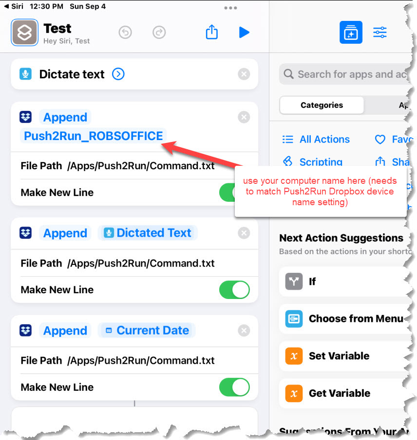

# Push2Run
## Set up for using an Apple iPhone/iPad and Dropbox

Welcome to the Push2Run set up page for using an Apple iPhone/iPad and Dropbox.  
  
Of note, Push2Run is not released nor supported by Apple or Dropbox.  
  
This page explains how to setup Push2Run and control your Windows computer using an Apple iPhone/iPad and Dropbox.  
  
The example below shows you how to open the Windows calculator on your PC or laptop.  
   
**What you will need, a:**   

|     |     |
| --- | --- |
|     | 1\. Apple iPhone/iPad with Siri enabled      2\. Windows computer      3\. (free or paid) account with [Dropbox](https://www.dropbox.com/) and Dropbox installed and in use on the iPhone/iPad and on your Windows computer      4\. (free) copy of [Push2Run](https://github.com/roblatour/Push2Run)  |

 

**What to do:**  
 
Now comes the part that's kind of like [Mousetrap](https://en.wikipedia.org/wiki/Mouse_Trap_(game)), here is how it all fits together ...  

|     |     |
| --- | --- |
| 1.  | Install and run Push2Run on your PC or Laptop. When Push2Run is first run you should be prompted to setup up Dropbox,Pushbullet, Pushover, or MQTT; these instructions explain how to setup Dropbox. |
| 2.  | On the Push2Run - Options window, in the Dropbox settings:   \- check 'Enable Dropbox' \- enter a Dropbox folder path specific to use with Push2Run. The folder name can be anything you want on your local Dropbox drive, and be more than one layer down (as in the example below - where it is folder called Push2Run inside another folder called Apps). The Dropbox folder path entered here should end in a "\\" (without the quotes.  Please enter the Dropbox folder path including the drive letter (as seen below).  You need to remember what you set up here for step 6 below.  \- enter a file name specific for use with Dropbox. The default is Command.txt but it can be anything you want.  You need to remember what you set up here for step 6 below. - leave the Device name set to its default value (although you can change it if you like) - this too is also used in step 6 below.   - click OK to close the Options window. |
| 3.  | Sign on to your Apple iPhone/iPad |
| 4.  | Open the Apple Shortcuts application; one way to do this is to say "Hey Siri, open shortcuts" |
| 5   | A screen should appear, tap on the "+" beside the 'Select' at the top of the screen |
| 6.  | While perhaps not obvious, the screen will be waiting for you to enter a name for your shortcut, enter "Tell my computer to" (without the quotes) for the name of the shortcut |
| 7.  | In search box, search for and add "Dictate Text" |
| 5.  | In the search box search for and add "Append to Dropbox Text file"      Do this step 3 times, so there are three actions of Append to Dropbox Text file added to your short cut |
| 6.  | Now this is the part that I personally found particular frustrating to set up via editing within the Apple Short App program (but there is a screen shot below in step 6.4 that shows the final result) .... |
| 6.1 | The first Append to Dropbox Text file entry needs to be edited to append the text   Push2Run\_YourComputerName  where YourComputerName would be your computer name as identified in step 2 above.      Also the file path needs to be the Dropbox folder path, starting with /Apps as identified in step 2 above.      Also, the while the slash on your PC is a forward slash ("/"), the slash as entered on your Apple device is a backslash ("\\")  The Make New Line option should be slid to On (Green) |
| 6.2 | The second Append to Dropbox Text file entry needs to be edited append the Shortcuts Magic Variable Dictate text  and the file path needs to be the same as in step 6.1      The Make New Line option should be slid to On (Green) |
| 6.3 | T he second Append to Dropbox Text file entry needs to be edited append the Shortcuts Magic Variable Current Date  and the file path needs to be the same as in step 6.1      The Make New Line option should be slid to On (Green) |
| 6.4 |  |
| 7.  | Tap on 'Done' |
| 8.  | (optional) Press and hold on the shortcut, a window should open, press "Details", and then press the option 'Add to Home Screen" |
| 9.  | Give it a try by saying "**Hey Siri tell my computer to**"      pause speaking until you hear Siri say "**What's the text**"      say "**open the calculator**" |

## Final notes:  
  
Using the above approach, the dropbox file seems to get created / uploaded in three stages - line1 then line 2 then line 3 (rather than fully created and the uploaded as a single file). This causes a bunch of extra processing that is displayed in the Push2Run session log, but ultimately it processed ok.    
  
Push2Run will delete the Command.txt file when it is done with it, so the Apple shortcut does not need too.  
  
The date and time on your Apple device should be in relative sync with your Windows Computer. By default it the date and time are out of sync by more than three minutes Push2Run will not execute the command.  
  
  
Also, there may be a better way of doing this. I have been experiencing with trying to first create a file, append to it, and then copy it to the needed dropbox location (so that it does not get updated line by line on the dropbox drive - but as of yet have not succeeded.  If I can figure this out (or someone helps me to do that) I'll update this page.  
      
* * *
  
**For additional help**  
  
Please see the [Push2Run Help documentation](help_v4.9.0.0.md).

* * *
 ## Support Push2Run

 To help support Push2Run, or to just say thanks, you're welcome to 'buy me a coffee'  

* * *
Copyright © 2018 - 2025 Rob Latour
* * *