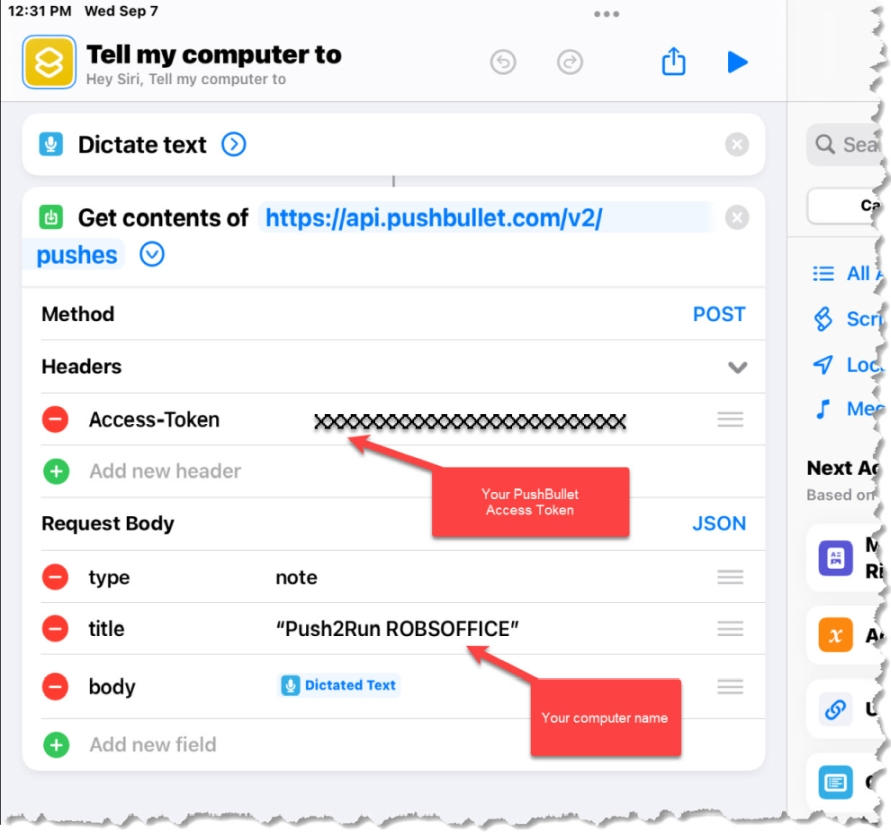

# Push2Run
## Setup instructions for using an Apple iPhone/iPad and Pushbullet

Welcome to the Push2Run set up page for using an Apple iPhone/iPad and Pushbullet.  
  
Of note, Push2Run is not released nor supported by Apple or Pushbullet.  
  
This page explains how to setup Push2Run and control your Windows computer using an Apple iPhone/iPad and Pushbullet.  
  
The example below shows you how to open the Windows calculator on your PC or laptop.  
   
**What you will need, a:**   

|     |     |
| --- | --- |
|     | 1\. Apple iPhone/iPad with Siri enabled      2\. Windows computer      3\. (free or paid) account with [PushBullet](https://www.pushbullet.com/)      4\. (free) copy of [Push2Run](https://github.com/roblatour/Push2Run)  |

 

**What to do:**  
 
Now comes the part that's kind of like [Mousetrap](https://en.wikipedia.org/wiki/Mouse_Trap_(game)), here is how it all fits together ...  
  

|     |     |
| --- | --- |
| 1.  | Go to the [Pushbullet website](https://www.pushbullet.com) and sign on to your account (if you don't have one you'll need to create one), |
| 2.  | Click on 'Settings' in the left navigation bar, |
| 3.  | Click on 'Account' to the top left of the left navigation bar, |
| 4.  | Click on 'Create Access Token', and a box will appear containing your Pushbullet Access Token, |
| 5.  | Copy your Pushbullet Access Token into your Windows clipboard   (i.e. select your Access Token with your mouse, right click, and select 'copy'), |
| 6.  | Install and run Push2Run on your PC or Laptop,       When Push2Run is first run you should be prompted to setup up Dropbox, Pushbullet, Pushover, or MQTT; these instructions explain how to setup Pushbullet. |
| 7.  | On the Push2Run Options window, in the Pushbullet settings,      check the option 'Enable Pushbullet'      paste (i.e. right click and select 'Paste') your Pushbullet Access Token from your Windows Clipboard into the field named 'Pushbullet Access Token',      copy what it says in the 'Title filter' field into your Windows clipboard, and      click 'OK',      note: by default your Title Filter will be loaded with 'Push2Run xxx' where xxx is your computer name.  In the example below it says 'Push2Run ROBSPC' as my computer's name is 'ROBSPC'. |

   

|     |     |     |
| --- | --- | --- |
|     |  |     |

     

Note: the phrase is part of what you will say when you want to run this specific action.  In the example above, it is "open the calculator" but of course it can be something else.   

|     |     |
| --- | --- |
| 8.  | Sign on to your Apple iPhone/iPad |
| 9.  | Open the Apple Shortcuts application; one way to do this is to say "Hey Siri, open shortcuts" |
| 10  | A screen should appear, tap on the "+" beside the 'Select' at the top of the screen |
| 11. | While perhaps not obvious, the screen will be waiting for you to enter a name for your shortcut, enter "Tell my computer to" (without the quotes) for the name of the shortcut |
| 12. | In search box, search for and add "Dictate Text" |
| 13. | In  the search box search for and add "Get contents of url" |
| 14. | For the url of the Get contents of, use:      [https://api.pushbullet.com/v2/pushes](https://api.pushbullet.com/v2/)      For the Method select 'POST' from the drop down menu      Under Headers add:      Access-Token           your Pushbullet Access Token from Step 6 above      Under Request Body add:      type                            note   title                             "Push2Run YourComputerName"   body                          Dictated text      **Notes:   **   A. Where you see quotes above, please ensure to include them; where you don't see quotes above please ensure not to use them.      B. YourComputerName is your computer's name, mine is ROBSPC (as shown in Step 7 above).      C. Dictated text is a 'Magic Variable' in the Apple Shortcuts app - do not type Dictated text, rather select it in the Apple shortcuts app.      D. the words type, note, title and body should not be capitalized      Your settings should look like this: |
|     |  |
| 15. | Tap on 'Done' |
| 16. | (optional)  Press and hold on the shortcut, a window should open, press "Details", and then press the option 'Add to Home Screen" |
| 17. | Give it a try by saying "**Hey Siri tell my computer to**"      pause speaking until you hear Siri say "**What's the text**"      say "**open the calculator**" |

      
Final notes:  
  
I know of no easy way to copy your PushBullet access token from your PC to your iPhone/iPad.  I manually typed mine in.  However, I suspect you could sign on the PushBullet website from a browser on your iPhone/iPad and do a copy and paste from there.  
     
* * *
  
**For additional help**  
  
Please see the [Push2Run Help documentation](help_v4.9.0.0.md).

* * *
 ## Support Push2Run

 To help support Push2Run, or to just say thanks, you're welcome to 'buy me a coffee'  

* * *
Copyright © 2018 - 2025 Rob Latour
* * *