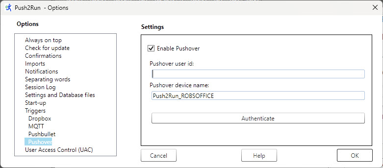
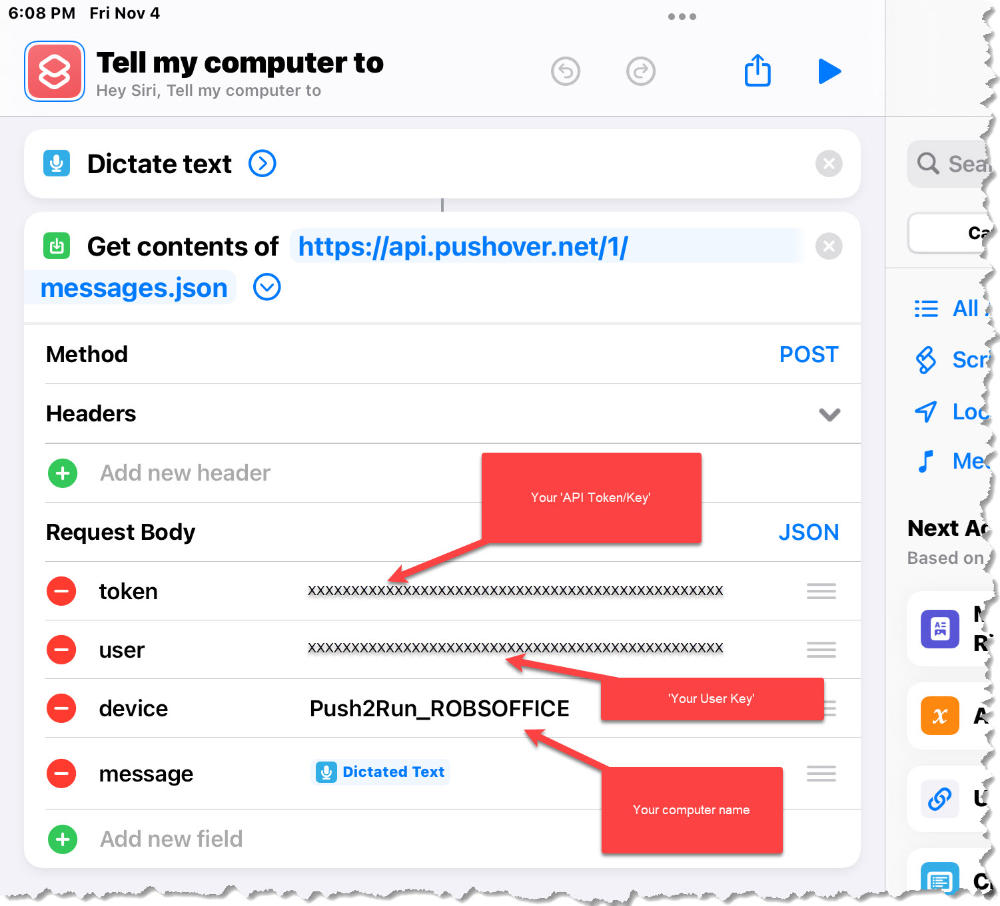

# Push2Run
## Set up for using an Apple iPhone/iPad and Pushover

Welcome to the Push2Run set up page for using an Apple iPhone/iPad and Pushover.  
  
Of note, Push2Run is not released nor supported by Apple or Pushover.  
  
This page explains how to setup Push2Run and control your Windows computer using an Apple iPhone/iPad and Pushover.  
  
The example below shows you how to open the Windows calculator on your PC or laptop.  
   
**What you will need, a:**   

|     |     |
| --- | --- |
|     | 1\. Apple iPhone/iPad with Siri enabled      2\. Windows computer      3\. (free or paid) account with [Pushover](https://www.pushover.net)      4\. (free) copy of [Push2Run](https://github.com/roblatour/Push2Run)  |
 

**What to do:**  
  
Now comes the part that's kind of like [Mousetrap](https://en.wikipedia.org/wiki/Mouse_Trap_(game)), here is how it all fits together ...  
  

|     |     |
| --- | --- |
| 1.  | Go to the [Pushover website](https://www.pushover.net) and sign on to your account (if you don't have one you'll need to create one) |
| 2.  | Take note of 'Your User Key' (top right of the window) you will need it for step x below |
| 3.  | Scroll down to where it says 'Your Devices' and click on where it says 'Add Phone, Tablet, or Desktop'      Select 'Pushover for Desktop'      Enter a device name, for example:           Push2Run\_YourComputerName      click 'Register Web Browser' |
| 4.  | Scroll down to where it says 'Your Applications' and click on where it says 'Create and Application/API Token'      Enter a name for your application, for example 'Apple iPad'      accept the Terms of Service (if they are acceptable to you)      click 'Create Application'      Take note of the API Token/Key you will need it for step x below |
| 5.  | Install and run Push2Run on your PC or Laptop  When Push2Run is first run you should be prompted to setup up Dropbox, Pushbullet, Pushover, or MQTT; these instructions explain how to setup Pushover. |
| 6.   | On the Push2Run - Options window, in the Pushover settings:      \- check 'Enable Pushover'      \- enter your Pushover user id (the email id you use to sign onto Pushover)      \- set the Pushover device name to the device name you used in Step 4 above |
|     |  \- click the 'Authenticate' button, and enter your Pushover password (your Pushover password is not stored by Push2Run but is passed to Pushover to authenticate  your use of Pushover by Push2Run), - if you have two factor authentication (2FA) enabled for Pushover, Push2Run will prompt you for your 2FA code which you can get from the 2FA authenticator you use for Pushover, \- click OK in the window which confirms that the Authentication is ok, \- click OK to close the Options window
| 7.  | Sign on to your Apple iPhone/iPad |
| 8.  | Open the Apple Shortcuts application; one way to do this is to say "Hey Siri, open shortcuts" |
| 9.  | A screen should appear, tap on the "+" beside the 'Select' at the top of the screen |
| 10.  | While perhaps not obvious, the screen will be waiting for you to enter a name for your shortcut, enter "Tell my computer to" (without the quotes) for the name of the shortcut |
| 11. | In search box, search for and add "Dictate Text" |
| 12. | In  the search box search for and add "Get contents of url" |
| 13. | For the url of the Get contents of, use:  https://api.pushover.com/1/messages.json  For the Method select 'POST' from the drop down menu  Leave the section under Headers unchanged.  Under Request Body add:  token                       type in your API Token/Key from Step 4 above user                             type in your User Key from Step 2 above device                      type in your device name from Step 3 above    message                  select Dictated text  **Notes:   **   A. Do not include quotes around any of the information you type in above      B. Dictated text is a 'Magic Variable' in the Apple Shortcuts app - do not type Dictated text, rather select it in the Apple shortcuts app.      C. the words token, user, device and message should not be capitalized      Your settings should look like this: |
|     |  |
| 14. | Tap on 'Done' |
| 15. | (optional)  Press and hold on the shortcut, a window should open, press "Details", and then press the option 'Add to Home Screen" |
| 16. | Give it a try by saying "**Hey Siri tell my computer to**"      pause speaking until you hear Siri say "**What's the text**"      say "**open the calculator**" |

      
Final notes:  
  
I know of no easy way to copy your Pushover token or user key from your PC to your iPhone/iPad.  I manually typed mine in.  However, I suspect you could sign on the Pushover website from a browser on your iPhone/iPad and do a copy and paste from there.  
        
* * *
  
**For additional help**  
  
Please see the [Push2Run Help documentation](help_v4.9.0.0.md).

* * *
 ## Support Push2Run

 To help support Push2Run, or to just say thanks, you're welcome to 'buy me a coffee'  

* * *
Copyright © 2018 - 2025 Rob Latour
* * *