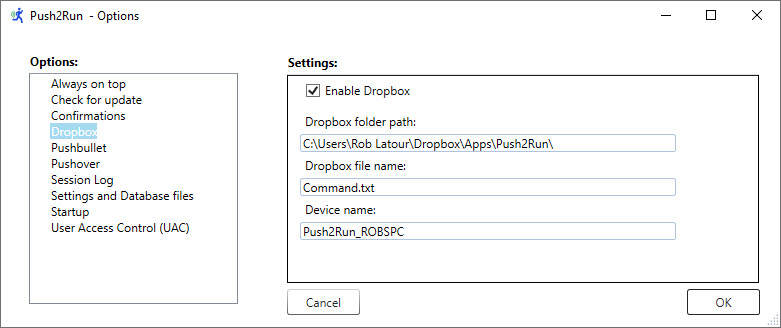
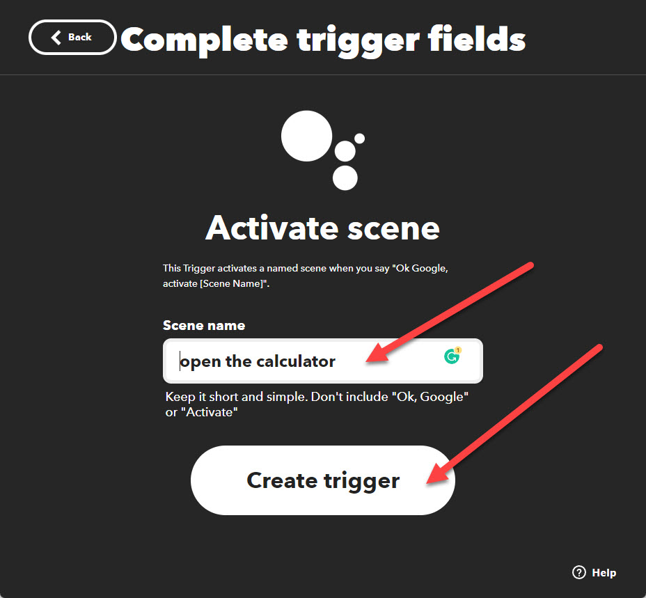

# Push2Run
## Set up for using a Google Assistant device with IFTTT and Dropbox

Welcome to the Push2Run set up page for using a Google Assistant device with IFTTT and Dropbox.  
  
Of note, Push2Run is not released nor supported by Google, IFTTT or Dropbox.  
  
This page explains how to setup Push2Run and control your Windows computer using a Google Assistant (Google Home, Google Mini, Google Max, or smart phone running Google Assistant), IFTTT and Dropbox.  
  
The example below shows you how to open the Windows calculator on your PC or laptop.  
   
**What you will need, a:**   

|     |     |
| --- | --- |
|     | 1\. Google Home, Google Mini, Google Max, or smart phone running Google Assistant      2\. Windows computer      3\. (free or paid) account with [Dropbox](https://www.dropbox.com/individual/plans-comparison)      4\. (free) copy of [Push2Run](https://github.com/roblatour/Push2Run)      5\. (free) account with [IFTTT](https://ifttt.com) (note: a free IFTTT account only allows you to create two applets / Push2Run commands) |

 

**What to do:**  

Now comes the part that's kind of like [Mousetrap](https://en.wikipedia.org/wiki/Mouse_Trap_(game)), here is how it all fits together ...  

|     |     |
| --- | --- |
| 1.  | Signup for a Dropbox account at the [Dropbox website](https://www.dropbox.com/) and then download and install the [Dropbox software](https://www.dropbox.com/install) on your computer |
| 2.  | Install and run Push2Run on your PC or Laptop      When Push2Run is first run you should be prompted to setup up Dropbox, Pushbullet, Pushover, or MQTT; these instructions explain how to setup Dropbox. |
| 3.  | On the Push2Run - Options window, in the Dropbox settings:      \-  check 'Enable Dropbox'      \- enter a Dropbox folder path specific to use with Push2Run.  The folder name can be anything you want on your local Dropbox drive, and be more than one layer down (as in the example below - where it is folder called Push2Run inside another folder called Apps).  The Dropbox folder path entered here should end in a "\\" (without the quotes.  Please enter the Dropbox folder path including the drive letter (as seen below).  You need to remember what you set up here for step 14 below.      \- enter a file name specific for use with Dropbox.  The default is Command.txt but it can be anything you want.  You need to remember what you set up here for step 14 below.      \- leave the Device name set to its default value (although you can change it if you like) - this too is also used in step 14 below. |

   

|     |     |     |
| --- | --- | --- |
|     |  |     |

   
  - click OK to close the Options window  
  

|     |     |
| --- | --- |
| 4.  | Sign onto [IFTTT](https://ifttt.com)       Notes:      a) if you don't already have an IFTTT account, you will need to click on 'Sign up' to create one; its easiest if you sign on using your gmail account via the 'Continue with Google' option      b) if you haven't already linked your Google account, click on the icon of a person's head (top right), click on 'My Services' - from this window link your Google account to IFTTT - to do this click on "Google Assistant v2" and complete the process.  When linking your Google account to IFTTT you should use the same gmail account that you used to link your Google devices in the Google Home mobile app.      Also, while in 'My Services' you should also link your Dropbox account; if you don't do this now you will be prompted to this in step 14. |
| 5.  | In IFTTT click on the icon of a person's head (top right), click on 'Create', |
| 6.  | On the IFTTT "Create" window, click on the "**\+ this**" in the "**if + this then that**", |
| 7.  | In the search for services, search for "Google Assistant v2" and select it, |
| 8.  | Select "Activate Scene",       |
| 9.  | Enter a scene name: |

    

Note: the scene name is part of what you will say when you want to run this specific action.  In the example above, it is "open the calculator" but of course it can be something else. 1  

|     |     |
| --- | --- |
| 10  | Click on "Create trigger", |
| 11. | Click on "**then that**" in the "**if + this then that**", |
| 12. | Click on Dropbox, |
| 13. | Click on 'Create a text file', |
| 14. | Complete the IFTTT-Dropbox 'Complete action fields' window as below      **Notes:      Linking you Dropbox account:   **If you have not linked your Dropbox account to IFTTT before, you will be prompted to do so in this step.      **Dropbox Account:   **select your dropbox account from the dropdown field   **the File name field:**   should have the same value as was used in step 3 above.  The default is:   Command.txt      **the Content field:**   should contain:   the Device name you used in step 3 above.  It should be followed by " " without the quotes as shown below,   followed by the IFTTT ingredient {{SceneName}} and by " " without the quotes as shown below,   followed by the IFTTT ingredient {{ActivatedAt}} and by " " without the quotes as shown below.   (do not have any blank or extra lines after that)      **the Dropbox folder path:**  should contain the part of the folder path used in step 3 above which **follows ....\\Dropbox\\   **the Dropbox folder path used here should **not** end in a slash.      Please see the screenshot below for greater clarity.      **\*\*\* Important \*\*\*** If you include a slash in the Dropbox folder path as in the screen shot below, please make sure it is a forward slash ("/") not a backslash ("\\").  If you use a forward slash your IFTTT applet will work, if you use a backslash it will not work and you will get an error message in your IFTTT activity history that says the Applet failed and there was a problem with the Dropbox service (but no other clue as to what the problem may be). |

   
  

|     |     |
| --- | --- |
| 15. | Click on "Create action", |
| 16. | Click "Finish", |
| 17. | Give it a try by saying to your Google Assistant       "**OK Google action open the calculator**". |
|     |     |

      
**Note:** depending on the virus software you are running, when Push2Run first attempts to access your Dropbox folder you may be prompted to give it permission to do so.  When working with Dropbox Push2Run only works with the Dropbox folder path and filename you specify (in step 3 above).  
       
* * *
  
**For additional help**  
  
Please see the [Push2Run Help documentation](help_v4.9.0.0.md).

* * *
 ## Support Push2Run

 To help support Push2Run, or to just say thanks, you're welcome to 'buy me a coffee'  

* * *
Copyright © 2018 - 2024 Rob Latour
* * *