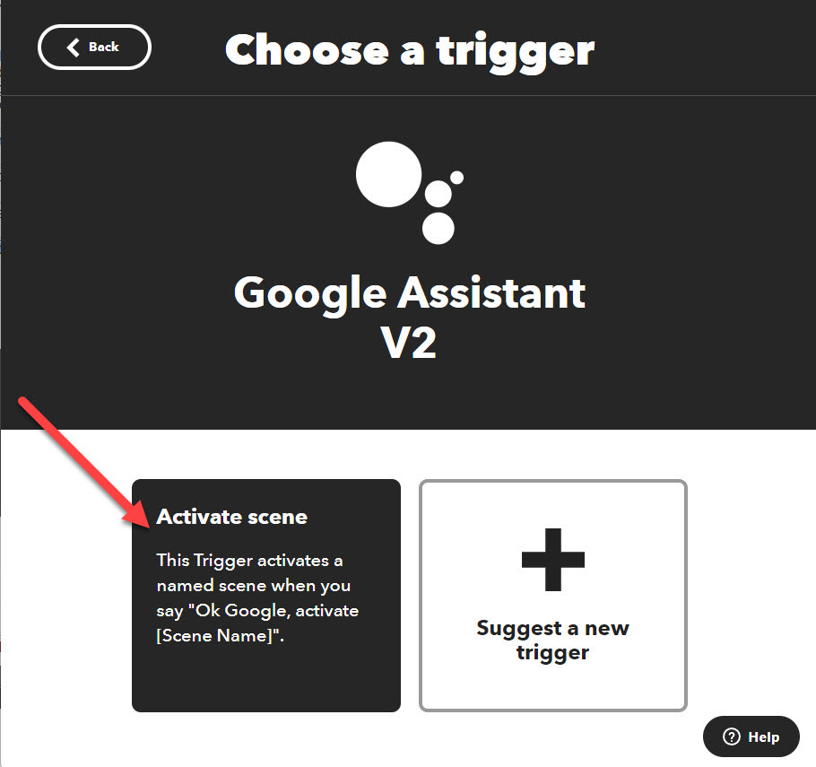
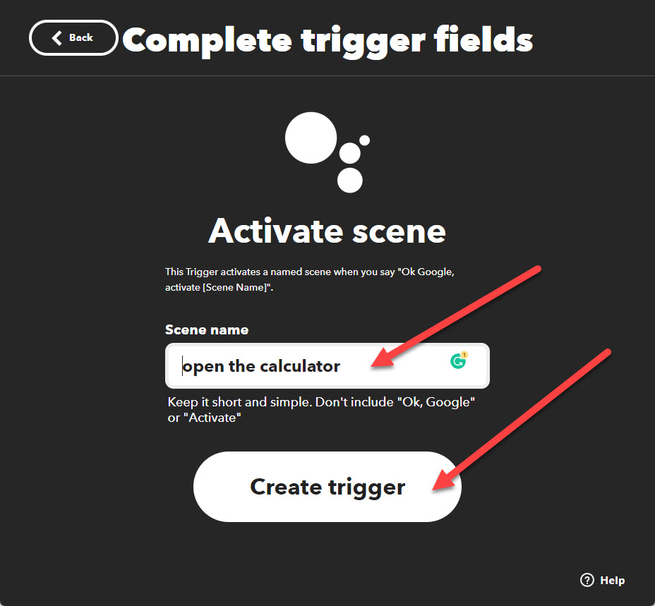

# Push2Run 
## Set up for using a Google Assistant device with IFTTT and Pushbullet

Welcome to the Push2Run set up page for using a Google Assistant device with IFTTT and Pushbullet.  
  
Of note, Push2Run is not released nor supported by Google, IFTTT or Pushbullet.  
  
This page explains how to setup Push2Run and control your Windows computer using a Google Assistant (Google Home, Google Mini, Google Max, or smart phone running Google Assistant), IFTTT and Pushbullet.  
  
The example below shows you how to open the Windows calculator on your PC or laptop.  
   
**What you will need, a:**   

|     |     |
| --- | --- |
|     | 1\. Google Home, Google Mini, Google Max, Nest or smart phone running Google Assistant      2\. Windows computer      3\. (free or paid) account with [PushBullet](https://www.pushbullet.com/)      4\. (free) copy of [Push2Run](https://github.com/roblatour/Push2Run)      5\. (free) account with [IFTTT](https://ifttt.com) (note: a free IFTTT account only allows you to create two applets / Push2Run commands) |

 

**What to do:**  

Now comes the part that's kind of like [Mousetrap](https://en.wikipedia.org/wiki/Mouse_Trap_(game)), here is how it all fits together ...  
  

|     |     |
| --- | --- |
| 1.  | Go to the [Pushbullet website](https://www.pushbullet.com) and sign on to your account (if you don't have one you'll need to create one), |
| 2.  | Click on 'Settings' in the left navigation bar, |
| 3.  | Click on 'Account' to the top left of the left navigation bar, |
| 4.  | Click on 'Create Access Token', and a box will appear containing your Pushbullet Access Token, |
| 5.  | Copy your Pushbullet Access Token into your Windows clipboard   (i.e. select your Access Token with your mouse, right click, and select 'copy'), |
| 6.  | Install and run Push2Run on your PC or Laptop, When Push2Run is first run you should be prompted to setup up Dropbox, Pushbullet, Pushover, or MQTT; these instructions explain how to setup Pushbullet. |
| 7.  | On the Push2Run Options window, in the Pushbullet settings,      check the option 'Enable Pushbullet'      paste (i.e. right click and select 'Paste') your Pushbullet Access Token from your Windows Clipboard into the field named 'Pushbullet Access Token',      copy what it says in the 'Title filter' field into your Windows clipboard, and      click 'OK',      note: by default your Title Filter will be loaded with 'Push2Run xxx' where xxx is your computer name.  In the example below it says 'Push2Run ROBSPC' as my computer's name is 'ROBSPC'. |

   

|     |     |     |
| --- | --- | --- |
|     |  |     |

   

|     |     |
| --- | --- |
| 8.  | Sign onto [IFTTT](https://ifttt.com)       Notes:      a) if you don't already have an IFTTT account, you will need to click on 'Sign up' to create one; its easiest if you sign on using your gmail account via the 'Continue with Google' option      b) if you haven't already linked your gmail account, click on the icon of a person's head (top right), click on 'Account' - from this window link your Google account to IFTTT; you should use the same Google account  you have linked to your Google Home/Mini/Max/device). You should also link your Pushbullet account; you will be prompted to do this in step 18.      b) if you haven't already linked your Google account, click on the icon of a person's head (top right), click on 'My Services' - from this window link your Google account to IFTTT - to do this click on "Google Assistant v2" and complete the process.  When linking your Google account to IFTTT you should use the same gmail account that you used to link your Google devices in the Google Home mobile app.      Also, while in 'My Services' you should also link your Pushbullet account; if you don't do this now you will be prompted to this in step 18. |
| 9.  | In IFTTT click on the icon of a person's head (top right), click on 'Create', |
| 10. | On the IFTTT "Create" window, click on the "**\+ this**" in the "**if + this then that**", |
| 11. | In the search for services, search for "Google Assistant v2" and select it, |
| 12. | Select "Activate Scene",       |
| 13. | Enter a scene name: |

    

Note: the scene name is part of what you will say when you want to run this specific action.  In the example above, it is "open the calculator" but of course it can be something else.   

|     |     |
| --- | --- |
| 14  | Click on "Create trigger", |
| 15. | Click on "**then that**" in the "**if + this then that**", |
| 16. | Click on Pushbullet, |
| 17. | Click on 'Push a note', |
| 18. | Complete the IFTTT-Pushbullet 'Push a note', pasting the words you copied into your clipboard in step seven above, into the 'Title' field: |

   
  

|     |     |
| --- | --- |
|     | **Please note:**      If you have not linked your Pushbullet account to IFTTT before, you will be prompted to do so in this step.      On the Push a note window, under where it says 'Message' you may initially see some text filled in, delete this and then then type in the phrase you would like Push2Run to respond to: for example:   open the calculator |
| 19. | Click on "Create action", |
| 20. | Click "Finish", |
| 21. | Give it a try by saying to your Google Assistant       "**OK Google action open the calculator**". |

       
* * *
  
**For additional help**  
  
Please see the [Push2Run Help documentation](help_v4.9.0.0.md).

* * *
 ## Support Push2Run

 To help support Push2Run, or to just say thanks, you're welcome to 'buy me a coffee'  

* * *
Copyright © 2018 - 2024 Rob Latour
* * *