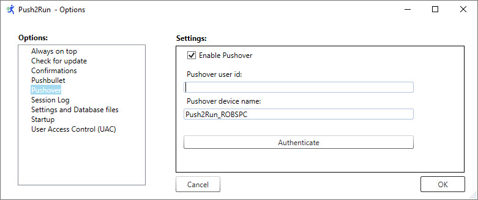
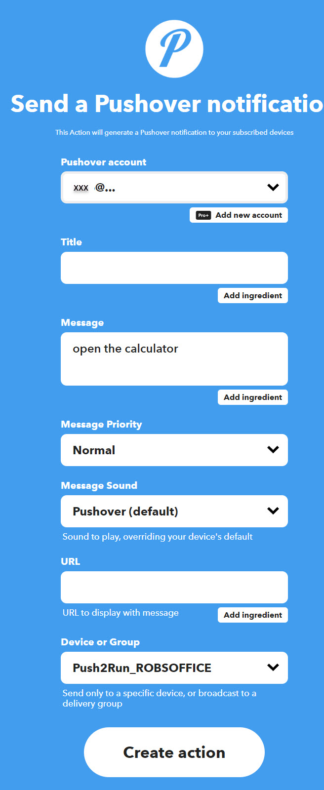

# Push2Run 
## Set up for using a Google Assistant device with IFTTT and Pushover

Welcome to the Push2Run set up page for using a Google device Assistant with IFTTT and Pushover.  
  
Of note, Push2Run is not released nor supported by Google, IFTTT or Pushover.  
  
This page explains how to setup Push2Run and control your Windows computer using a Google Assistant (Google Home, Google Mini, Google Max, or smart phone running Google Assistant), IFTTT and Pushover.  
  
The example below shows you how to open the Windows calculator on your PC or laptop.  
   
**What you will need, a:**   

|     |     |
| --- | --- |
|     | 1\. Google Home, Google Mini, Google Max, or smart phone running Google Assistant      2\. Windows computer      3\. (free or paid) account with [Pushover](https://pushover.net/)      4\. (free) copy of [Push2Run](https://github.com/roblatour/Push2Run)      5\. (free) account with [IFTTT](https://ifttt.com) (note: a free IFTTT account only allows you to create two applets / Push2Run commands) |

**What to do:**  

Now comes the part that's kind of like [Mousetrap](https://en.wikipedia.org/wiki/Mouse_Trap_(game)), here is how it all fits together ...  
  

|     |     |
| --- | --- |
| 1.  | Signup for a Pushover account at the  [Pushover website](https://pushover.net/) |
| 2.  | Install and run Push2Run on your PC or Laptop       When Push2Run is first run you should be prompted to setup up Dropbox, Pushbullet, Pushover, or MQTT; these instructions explain how to setup Pushover. |
| 3.  | On the Push2Run - Options window, in the Pushover settings:      \-  check 'Enable Pushover'      \- enter your Pushover user id (the email id you use to sign onto Pushover)      \- leave the Pushover device name set to its default value (although you can change it if you like) |

   

|     |     |     |
| --- | --- | --- |
|     |  |     |

   
   - click the 'Authenticate' button, and enter your Pushover password  
     (your Pushover password is not stored by Push2Run but is passed to Pushover to authenticate  
     your use of Pushover by Push2Run),  
  
  - if you have two factor authentication (2FA) enabled for Pushover, Push2Run will prompt you for your 2FA code which you can get from the 2FA authentictor you use for Pushover,  
  
\- click OK in the window which confirms that the Authentication is ok,  
  
\- click OK to close the Options window  
  

|     |     |
| --- | --- |
| 4.  | Sign onto [IFTTT](https://ifttt.com)       Notes:      a) if you don't already have an IFTTT account, you will need to click on 'Sign up' to create one; its easiest if you sign on using your gmail account via the 'Continue with Google' option      b) if you haven't already linked your Google account, click on the icon of a person's head (top right), click on 'My Services' - from this window link your Google account to IFTTT - to do this click on "Google Assistant v2" and complete the process.  When linking your Google account to IFTTT you should use the same gmail account that you used to link your Google devices in the Google Home mobile app.      Also, while in 'My Services' you should also link your Pushover account; if you don't do this now you will be prompted to this in step 18. |
| 5.  | In IFTTT click on the icon of a person's head (top right), click on 'Create', |
| 6.  | On the IFTTT "Create" window, click on the "**\+ this**" in the "**if + this then that**", |
| 7.  | In the search for services, search for "Google Assistant v2" and select it, |
| 8.  | Select "Activate Scene",       |
| 9.  | Enter a scene name: |

    

Note: the scene name is part of what you will say when you want to run this specific action.  In the example above, it is "open the calculator" but of course it can be something else.   

|     |     |
| --- | --- |
| 10  | Click on "Create trigger", |
| 11. | Click on "**then that**" in the "**if + this then that**", |
| 12. | Click on Pushover, |
| 13. | Click on 'Send a Pushover notification', |
| 14. | Complete the IFTTT-Pushover 'Complete action fields' window as below      **Notes:**      **Linking you Pushover account:**   If you have not linked your Pushover account to IFTTT before, you will be prompted to do so in this step.      **The 'Message' field:**   This should be the phrase you would like Push2Run to respond to, for example:   open the calculator      **The 'Device or Group' field:**   should be set to the device name used in step 3 above   (it may take a few minutes for this to become available following your authentication in step 3 above) |

   
  

|     |     |
| --- | --- |
| 15. | Click on "Create action", |
| 16. | Click "Finish", |
| 17. | Give it a try by saying to your Google Assistant       "**OK Google action open the calculator**". |

* * *
  
**For additional help**  
  
Please see the [Push2Run Help documentation](help_v4.9.1.0.md).

* * *
 ## Support Push2Run

 To help support Push2Run, or to just say thanks, you're welcome to 'buy me a coffee'  

* * *
Copyright © 2018 - 2025 Rob Latour
* * *