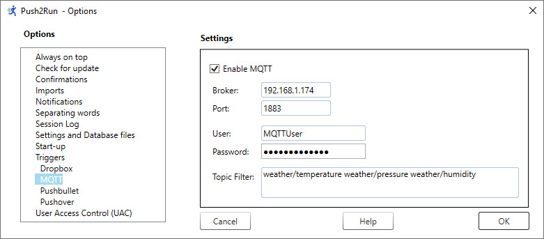
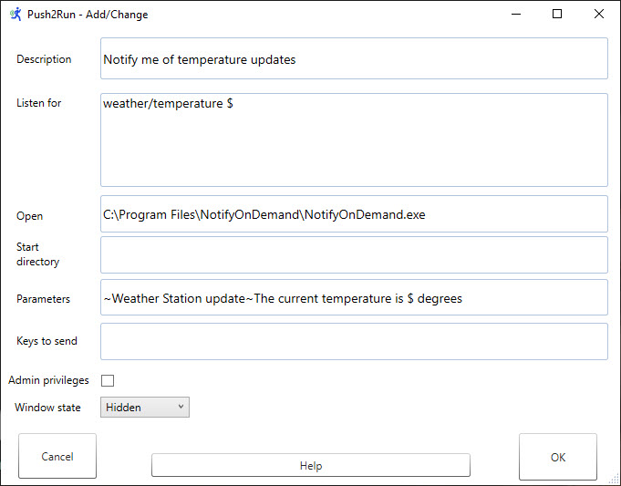

# Push2Run
## Set up for MQTT

Welcome to the Push2Run setup page for use with MQTT.  
  
This page explains how to setup Push2Run to control your Windows computer using MQTT.  
  
The example below shows you how to generate a Windows notification, telling you the current temperature when an MQTT temperature update is published by your MQTT server.  However, you can [click here](help/help_v4.8.0.0.html) to find out how to run any program, batch or script file, etc., in response to the MQTT message.  
   
**What you will need, a:**   

|     |     |
| --- | --- |
|     | 1\. Windows computer      2\. MQTT server that you can connect to      3\. (free) copy of [Push2Run](https://github.com/roblatour/Push2Run)  |
 

**What to do:**  
  
|     |     |
| --- | --- |
| 1.  | Install and run Push2Run on your Windows computer      When Push2Run is first run you should be prompted to setup up Dropbox, Pushbullet, Pushover, or MQTT; these instructions explain how to setup MQTT. |
| 3.  | On the Push2Run - Options window, in the MQTT settings:      \- check 'Enable MQTT'      \- set the address of your MQTT Broker, for example 192.168.1.172      \- set the MQTT port number (usually 1883)      \- set your MQTT user name and password, and      \- set the topic(s) to which you would like to subscribe.      You may subscribe to as many MQTT topics as you like; just add these into the MQTT Topic Filter field in the MQTT Options window, with a space between each topic.  For example:                weather/   or         weather/temperature weather/pressure weather/humidity      To subscribe to all topics, just use the pound sign ("#") alone in the Topic Filter field.        When done, click 'OK'.      Push2Run will then start receiving all MQTT messages for the topics to which you have subscribed.      **Notes      **As Push2Run will process all incoming topics to which you subscribe, for performance reasons it is better to only subscribe to the topics you want Push2Run to action.        Having that said, when you are first getting started, you might want to subscribe to all topics using the pound sign, and look in the Push2Run Session log to see exactly how, and how often, they are coming in.        To view the Push2Run Session log, click on 'View - Session log' from the main window.      Push2Run requests Quality of Service - Exactly Once ( QOS 2 ) as described [here](https://www.hivemq.com/blog/mqtt-essentials-part-6-mqtt-quality-of-service-levels/) when subscribing to your MQTT server.      For now, Push2Run's MQTT feature only works with normal MQTT messaging.  That is to say MQTT with SSL, MQTT over WebSockets, and MQTT over WebSockets with SSL are currently unsupported. |

   

|     |     |     |
| --- | --- | --- |
|     |  |     |

   
 To trigger processing based on the MQTT message, in a Push2Run card just enter the topic you want Push2Run to react to in the 'Listen for' field.  To pass the MQTT message payload to another program, you can use the $ feature as explained in more detail [here](help_v4.9.0.0.md).  
  
Here is an example Push2Run card:  
  
  
    
   
The above Push2Run card makes use of the program NotifyOnDemand, available from here:  
[https://www.rlatour.com/notifyondemand/](https://github.com/roblatour/notifyondemand)  

* * *
  
**For additional help**  
  
Please see the [Push2Run Help documentation](help_v4.9.0.0.md).

* * *
 ## Support Push2Run

 To help support Push2Run, or to just say thanks, you're welcome to 'buy me a coffee'  

* * *
Copyright © 2018 - 2024 Rob Latour
* * *
